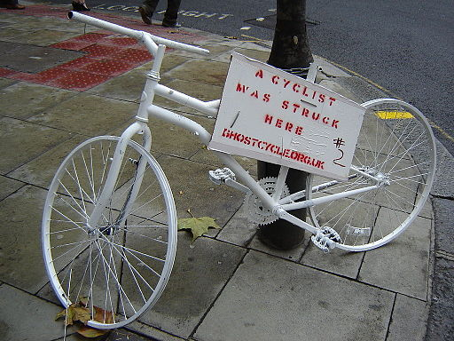

```{r include = FALSE}
knitr::opts_chunk$set(
  eval = TRUE,
  out.width = "80%",
  fig.asp = 0.618,
  fig.width = 10,
  dpi = 300
)
```

```{r photo, fig.margin = TRUE, echo = FALSE, fig.width = 3, fig.cap = "Photo by ProfDEH on Wikimedia Commons", eval = TRUE}

```

In this assignment we continue our examination of traffic accidents in New York State.

# Getting started

Accept the assignment from github classrooms, then go to the course GitHub organization and locate your homework repo, which should be named `hw03-pedestrian-YOUR_GITHUB_USERNAME`.
Grab the URL of the repo, and clone it in RStudio.
First, open the R Markdown document `hw03.Rmd` and Knit it.
Make sure it compiles without errors.
The output will be in the file markdown `.md` file with the same name.

## Warm up

Before we introduce the data, let's warm up with some simple exercises.

-   Update the YAML, changing the author name to your name, and **knit** the document.
-   `r emo::ji("broom")` Run `lint_assignment()` and verify that you are lint free.
-   Commit your changes with a meaningful commit message.
-   Push your changes to GitHub.
-   Go to your repo on GitHub and confirm that your changes are visible in your Rmd **and** md files. If anything is missing, commit and push again.

## Packages

Again, we use the **tidyverse**, `vroom`, `readxl` and `janitor` packages.
These packages is already installed for you.
You can load them by running the following in your Console:

```{r load-packages-data, message = FALSE, eval = TRUE}
library(tidyverse)
library(vroom)
library(readxl)
library(janitor)
```

## Data

We can load the data with the following:

```{r load-data, message = FALSE, results = 'hide'}
crashes = vroom("https://urmc-bst.github.io/bst430-fall2021-site/hw_lab_instruction/hw02-accidents/data/ny_collisions_2018_2019.csv.gz")
```

You can find out more about the dataset in the NY open data portal:  https://data.ny.gov/Transportation/Motor-Vehicle-Crashes-Case-Information-Three-Year-/e8ky-4vqe .  There's a detailed data dictionary [here](https://data.ny.gov/api/views/e8ky-4vqe/files/991fc5ad-3c1d-4eb1-908a-86343907be58?download=true&filename=NYSDMV_Crashes_CaseInformation_DataDictionary.pdf).

# Exercises

1.  Convert the names in crashes to `snake_case` using `janitor::clean_names()`.  Filter the crashes to only include fatal accidents.  You should have `r sum(crashes[['Crash Descriptor']] == 'Fatal Accident')` observations.

2.  Consider the `event_descriptor` column.  First, convert it to lower case.  Then, using `str_detect`, define the set of events that involve collisions with bicyclists or pedestrians.  Mutate `crashes` to add new variable called `is_pedbike` that identifies these.

3.  *i)* Convert values stored in `county_name` to **Title Case** (the purpose of this will become clear subsequently, I swear!)  *ii)*  Count the number of fatal crashes per county, per `is_pedbike` *iii)* Consider the top 20 counties (`county_name`) with the most fatal crashes in the data set. Make a barchart showing each county and the number of a) bicycle and pedestrian events and b) other events, filling the bars appropriately to show these two categories.  You will be graded on having an appropriate sort order for the county, and appropriate axis labels.

4.  Download the county population data for New York from [the previous census](https://www.census.gov/data/tables/time-series/demo/popest/2010s-counties-detail.html). Put the file into a sensible place in your rstudio project.  Load it using `read_csv`, clean up the column names using `janitor::clean_names`, filter it down to relevant rows, and select relevant columns from it.

```{marginfigure}
Hint: you will want to either remove the "County" part of the `ctyname` in the census data, using functions found in `stringr`, or mutate a new column in your `crashes` counts table that appends (glues) "County" onto the `county_name` variable.
```

5.  Join the population data to your table of crashes from Ex 3, and repeat your plot from Ex 3, now normalizing the number of events per county by the population.  (Fatalities per 100,000 population gives nice units here.) Your top 20 counties ought to be different here. Discuss what you find.

6.  Download the [vehicle miles traveled (VMT) per capita data](https://www7.transportation.gov/mission/health/transportation-and-health-tool-data-excel) available from the US Department of Transportation.  You can read more about it [here](https://www.transportation.gov/mission/health/vmt-capita#indicatordescription).  Put the file into a sensible place in your rstudio project and load the `Urbanized Area` sheet into R using `readxl`.  Cleanup the column names.

```{marginfigure}
**Hint**: your life will be made easier if you construct a "crosswalk" mapping the identifiers between the VMT dataset `urbanized_area` and `county_name` from the crashes data, either as a .csv file that you read in with `read_csv` or using the `tibble` or `tribble` function directly in your markdown. Then join the files using the crosswalk.  Here's an example of the first seven rows of such a crosswalk:

```

7.  Find the 13 rows in the VMT data that are primarily in New York (i.e. ignoring Dansbury and Bridgeport, CT-NY, which honestly do not include much, if any of New York) and contain a non-missing value for `vehicle_miles_traveled_per_capita_raw_value` using `filter` and `str_detect`. Using the list below, identify the counties corresponding to these `urbanized_areas`, and join this to the table.  (This will not be a one-to-one join.)  Then join the fixed up VMT table to the fatal crash counts.

|Metro area              |County |
|:----------------------------|:-----------|
|New York-Newark, NY-NJ-CT    |Queens      |
|New York-Newark, NY-NJ-CT    |Kings       |
|New York-Newark, NY-NJ-CT    |New York    |
|New York-Newark, NY-NJ-CT    |Bronx       |
|New York-Newark, NY-NJ-CT    |Richmond    |
|Rochester, NY                |Monroe      |
|Buffalo, NY                  |Erie        |
|Albany-Schenectady, NY       |Albany      |
|Binghamton, NY-PA            |Broome      |
|Elmira, NY                   |Chemung     |
|Glens Falls, NY              |Warren      |
|Ithaca, NY                   |Tompkins    |
|Kingston, NY                 |Ulster      |
|Poughkeepsie-Newburgh, NY-NJ |Dutchess    |
|Saratoga Springs, NY         |Saratoga    |
|Syracuse, NY                 |Onondaga    |
|Utica, NY                    |Oneida      |

8.  Derive the fatalities per 100,000 vehicle miles traveled, per county, using the crash count table Ex 3 and 5.  Repeat your plot from Ex 5 (though now you will only have <s>16</s> 17 counties).  Discuss your findings.

9.  Which estimate, if any, would be most informative about the hazard rate of being a pedestrian/cyclist in NY state?  What other factors would be helpful in refining your estimate of the hazard?

`r emo::ji("broom")` 🧶 ✅ ⬆️ Lint, Knit, *commit, and push your changes to GitHub with an appropriate commit message. Make sure to commit and push all changed files so that your Git pane is cleared up afterwards and review the md document, and the lintr report on GitHub to make sure you're happy with the final state of your work.*

## Rubric

*  27 points correct and fully described answers @ 3 points per
*  5 points adequately describe commit history
*  10 points 0-2 lints, -.5 point for every lint past 2.
