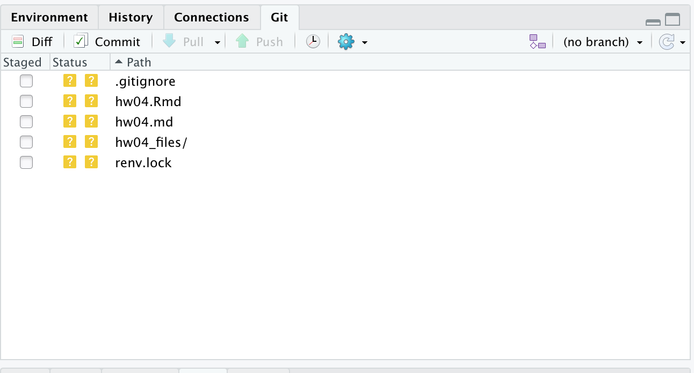

```{r include = FALSE}
knitr::opts_chunk$set(
  eval = TRUE,
  out.width = "80%",
  fig.asp = 0.618,
  fig.width = 6,
  error = FALSE
)
```

All good things must come to an end, and your access to rstudio.cloud will be one of them.
Here I do my best to install good hygiene in your future use of R.

# Getting started

*  If you don't already have R, [install the latest version](https://cloud.r-project.org/) (Optional) If you do have R, and you aren't in the midst of an intricate project with it, upgrade it to the latest version.
*  If you don't already have rstudio, [install it](https://www.rstudio.com/products/rstudio/download/preview/).  (Optional) If you do already have rstudio, upgrade it.  This is normally harmless and you might get some cool new features.
*  [Verify that you have git installed](https://happygitwithr.com/install-git.html).  If you don't have it, then install git.  **Be warned**, this could get messy!

```{r workspace, echo = FALSE, fig.margin = TRUE}
knitr::include_graphics('img/cursed.png')
```

*  Open rstudio, select "Tools -> Global Options"  Under the "General" pane and "Basic" tab (should open by default), and "Save workspace to .RData on exit" select "Never". Utter an oath that you will not change this value from "Never".


## Packages

You will need the `renv` package.  Install it with `install.packages("renv")`.  You may also need to the `usethis` package to finish our git setup.  Install it with `install.packages("usethis")`.

`renv` lets you manage the versions of your R packages on a per-project basis.  Managing packages is one of the greatest headaches in R, and if you don't do it right, your scripts will break and you won't be able to reproduce your work, let alone anyone else.  renv isn't perfect, but it's the best solution we've got, at the moment.

Basically, all you should need to do is always remember to click the "use renv" when you start a new project.  If you are collaborating with others, you can run
```{r, eval = FALSE}
renv::snapshot()
```
periodically to record the state of the package libraries.  Then, someone else who is working on your code base can get identical versions of the packages installed with
```{r, eval = FALSE}
renv::restore()
```


# Exercises

1.  In rstudio, make a new project with the "arrow dropdown" in the upper right -> "New Project" -> "New Project".  
*  Enter **hw04-**`<your github id>` for the directory name.  (This will be the name of your project and your github repo.)
*  Click "Create git repository" and "use renv".
*  Then create the new project!

2.  Now, make a new rmarkdown file and give it a meaningful title, author and date.  To do this:
*  Select File -> "New File" -> "R Markdown".  You may need to install some dependencies, if it asks to, click yes.
*  In the dialogue box that opens, select "Document" on the lefthand side, then you can give it a title and author.  Select "HTML" for the output type.  Click OK.
*  Now in the markdown that opens in the YAML header, change the output to "github_document".  My YAML looks like this
<pre>
---
title: "HW04"
author: "Andrew McTestStudent"
date: "10/27/2021"
output: github_document
---
</pre>

3.  Now we need to manage git so it doesn't commit a bunch of stuff in the project that `renv` added that we shouldn't commit.^[You can and should add other files to .gitignore that are installation-specific, as well as any files containing **secrets** (passwords, API keys, etc).  Although this repo will be private, and protected in principle, bots use the github API to discover leaked credentials in public repositories almost instantaneously.]
In the git pane, you should see a .Rprofile, .Rproj, and an renv/ directory all with [?] [?] under status.  These are uncommitted files, but we don't want to commit them now or by accident later, so we'll tell git to ignore them.  In the console, type
```{r, eval = FALSE}
usethis::use_git_ignore(c("renv/",
                          ".Rprofile",
                          "*.Rproj"))
```

Verify that these files no longer appear in the git pane.  It should look something like this:
```{r, echo = FALSE}

```

`r emo::ji("knit"); emo::ji("check")` **knit** and **commit**, but you don't have github set up yet, so you can't push.  If you get a message about setting your git configuration user id, etc, consult the [lab 01 instructions](https://urmc-bst.github.io/bst430-fall2021-site/hw_lab_instruction/lab01-hello-r.html) again to set up the git configuration.

4.  Now, we connect your repository to github.  There are many ways to do this, here's one working purely in R:
```{r, eval = FALSE}
usethis::use_github(organisation = 'URMC-BST', private = TRUE)
```

If you get errors about missing API keys, or not being about to authenicate, follow the instructions in [lab 01 instructions](https://urmc-bst.github.io/bst430-fall2021-site/hw_lab_instruction/lab01-hello-r.html) again to set up the git configuration.  Or you might just give up and follow [the recipe](https://happygitwithr.com/existing-github-last.html) for "existing project, github last" where you will explicitly create the repo on github.com.  If you do this **make sure it's owned by the URMC-BST organization** so we can see it and grade it.

5.  Remove all the "template" code from the file.  Then add the following code in a new chunks
```{r test-seed, eval = FALSE}
set.seed(1234)
sort(rnorm(5))
```

```{r print-session, eval = FALSE}
sessionInfo()
```

Lastly, run
```{r, eval = FALSE}
renv::snapshot()
```

to update your renv file and record the software versions you are using.

6.  Add a README file with a sentence or two explaining what this repository is.

🧶 ✅ ⬆️ Knit, *commit, and push your changes to GitHub with an appropriate commit message. Make sure to commit and push all changed files so that your Git pane is cleared up afterwards and review the md document on GitHub to make sure you're happy with the final state of your work.*

# Rubric

23 points.

18 points, apportioned across the six exercises as evenly as possible (recognizing some exercises didn't produce output).

5 points for commit history -- should have 2 commits minimum.
