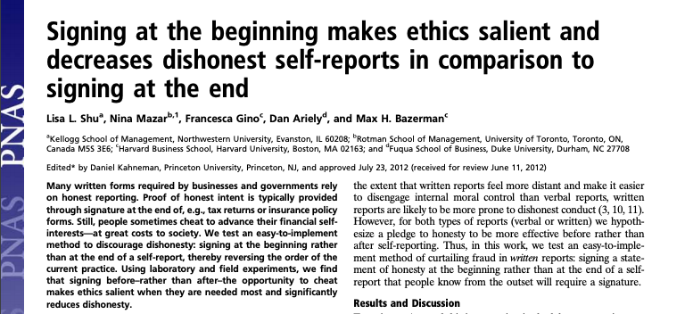
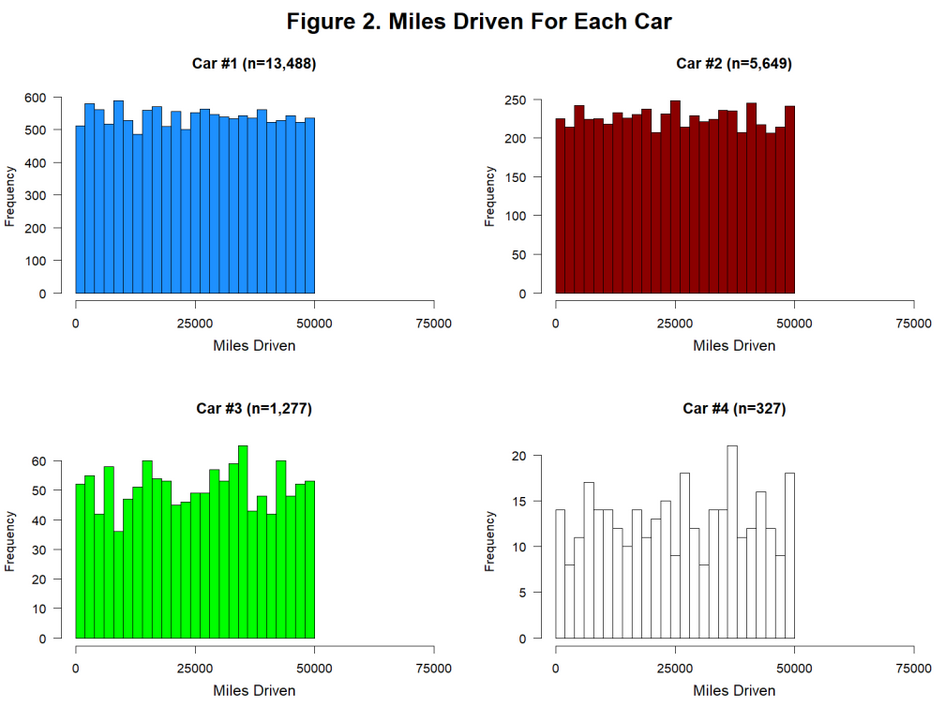

```{r setup, include=FALSE}
library(knitr)
library(tidyverse)
library(fontawesome)
options(
    htmltools.dir.version = FALSE,
    knitr.table.format = "html",
    knitr.kable.NA = ''
)
knitr::opts_chunk$set(
    warning = FALSE,
    message = FALSE,
    fig.path = "figs/",
    fig.width = 7.252,
    fig.height = 4,
    comment = "#>",
    fig.retina = 3 # Better figure resolution
) 
# Enables the ability to show all slides in a tile overview by pressing "o"
xaringanExtra::use_panelset()
xaringanExtra::use_extra_styles(
  hover_code_line = TRUE,
  mute_unhighlighted_code = FALSE
)

```

```{r echo=FALSE, message=FALSE, warning=FALSE}
library(tidyverse)
```

## Agenda

- Reproducibility
- GitHub, github classroom, and git -- make a handle, accept an assignment, make a commit
- Demo: A reproducible data analysis
   - R and RStudio
   - R Markdown
- Readings for Tuesday

---


## Reproducibility checklist

One of recurring themes in this class will be .alert[reproducibility].
Near-term goals:

- Can you reproduce tables and figures from the code and data?
- Can someone else reproduce  tables and figures from the code and data?
- Does the code actually do what you think it does?
- In addition to what was done, is it clear **why** it was done? 
(e.g., how were parameter settings chosen?)

Long-term goals:

- Can the code be used for other data?
- Can you extend the code to do other things?

---

class: center, middle

## Signing at the beginning increases honesty in comparison to signing at the end 
or the Cambria / Calibri Incident


---



In 2012, a team of researchers used laboratory and field experiments to conclude that  signing at the beginning rather than at the end of a self-report significantly reduces dishonesty.

???

Lab experiments (undergrads) and a field experiment with a car insurance company.  In the latter, there was a baseline measure of mileage then people were randomized into "before" vs after signing.  Comparing baseline self-report to post-treatment self-report identifies an unbiased treatment effect.

---


--
In 2020, many of these same researchers published a paper disavowing this finding.  

--
What happened?

???

Lots of things including a failure of a randomization, but mostly evidence of fraud 

---

## Near duplicated observations

.pull-left[
-  In the 2020 paper, the data from 2012 was posted (finally) as well, and something curious was noted about the fonts.
-  In many cases, near duplicate observations were found, with the Cambria observations being `runif(0, 1000)` larger than the Calibri pair.
-  See this [datacolada](http://datacolada.org/98) post for details.
]
.pull-right[
]

---

# Lessons learned

-  Avoid doing any serious work in excel, and
- especially don't use it to fabricate data.
-  Making it easier reproduce analyses may reduce the temptation to commit fraud.
-  But in most cases, programming errors rather than fraud are a greater risk.  .alert[Reproducible analyses help here too!]

---

## Toolkit


- Scriptability $\rightarrow$ R
- Literate programming (code, narrative, output in one place) $\rightarrow$ R Markdown
- Version control $\rightarrow$ Git / GitHub
---

class: center, middle

# Github and git

- https://github.com/

---

## How do we collaborate?

- The statistical programming language we'll use is R
- The software we use to interface with R is RStudio
- But how do I get you the course materials that you can build on for your assignments?
    + ❌ We're not going to email code back and forth, that would be a mess!
    + ❌ Blackboard has harsh 2007 vibes.
---

## GitHub accounts

- If you have a GitHub account and sit back and relax for a minute.
- If you do not yet have a GitHub account, create one now at https://github.com/. 
- Tips for selecting a username:<sup>1</sup>
    - Incorporate your actual name! People like to know who they’re dealing with. Also makes your username easier for people to guess or remember.
    - Reuse your username from other contexts if you can, e.g., Twitter or Slack.
    - Pick a username you will be comfortable revealing to your future boss.
    - Shorter is better than longer.
    - Be as unique as possible in as few characters as possible.
    - Make it timeless. Don’t highlight your current university, employer, or place of residence.

.footnote[ [1] Source: [Happy git with R](http://happygitwithr.com/github-acct.html#username-advice) by Jenny Bryan.]


---

# Join the classroom

- Once you have a github account, please go to [blackboard](learn.rochester.edu) and click the link to join the github classroom. I entered each of your names, so you can link your github accounts to your name and we can grade you.

---

## Version control

- We introduced GitHub as a platform for collaboration

- But it's much more than that...

- It's actually designed for version control

---

## Versioning


---

## Versioning

with human readable messages


---

## Why do we need version control?


---

# Git and GitHub tips

- Git is a version control system -- like “Track Changes” features from Microsoft Word on steroids. GitHub is the home for your Git-based projects on the internet -- like DropBox but much, much better).
- There are hundreds git commands -- it's used for the Linux kernel for chrissakes.  But 95% of the time you will only need three commands: `commit`, `push`, `pull` (maybe also `add`  and adjust the `remote` repositories you sync with).
- We will be doing Git things and interfacing with GitHub through RStudio, but if you google for help you might come across methods for doing these things in the command line -- you can skip that and move on to the next resource for the moment.
- [happygitwithr.com](http://happygitwithr.com/)  is the recommended resource and reference for working with git and R.

---

class: center, middle

## Read and Analyze some data

DEMO!

---

## Recap: What did we just do?

- Locate a repository on **GitHub**

- Clone and open the project in **RStudio**

- Run the analysis using **R Markdown**

- Edit the file

- Re-run the analysis using **R Markdown**


---

class: center, middle

# R and RStudio

---

## What is R/RStudio?

- R is a statistical programming language

- RStudio is a convenient interface for R (an integrated development environment, IDE)

---

class: center, middle

## Let's take a tour - R / RStudio

Demo!

---

Concepts introduced:

- Opening a project
- Console
- Using R as a calculator
- Environment
- Loading and viewing a data frame
- Accessing a variable in a data frame
- R functions
- Getting help

---

## R essentials

A short list (for now):

- Functions are (most often) verbs, followed by what they will be applied to in parentheses:

```{r eval=FALSE}
do_this(to_this)
do_that(to_this, to_that, with_those)
```

--

- Columns (variables) in data frames are accessed with `$`:

```{r eval=FALSE}
dataframe$var_name
```

--

- Packages are installed with the `install.packages` function and loaded with the `library` function, once per session:

```{r eval=FALSE}
install.packages("package_name")
library(package_name)
```

---

## What is the Tidyverse?

.pull-left[

]

.pull-right[
<center>
<a href="https://www.tidyverse.org/">tidyverse.org</a>
</center>

- The tidyverse is an opinionated collection of R packages designed for data science. 
- All packages share an underlying philosophy and a common syntax. 
]

---

class: center, middle

# R Markdown

---


## R Markdown

- Fully reproducible reports -- each time you knit the analysis is run from the beginning

- Simple markdown syntax for text

- Code goes in chunks, defined by three backticks (`), narrative goes outside of chunks

---

class: center, middle

## Let's take a tour -- R Markdown

Demo!

---

## R Markdown tips

- Keep the [R Markdown cheat sheet](https://github.com/rstudio/cheatsheets/raw/master/rmarkdown-2.0.pdf) and Markdown Quick Reference (Help -> Markdown Quick Reference) handy, you'll refer to it often as the course progresses

- The workspace of your R Markdown document is separate from the Console (so variables can have different values)

---

## How will we use R Markdown?

- Every assignment / report / project / etc. is an R Markdown document

- You'll always have a template R Markdown document to start with

- The amount of scaffolding in the template will decrease over the semester


<!-- Accessing the CandyWeight repository from rstudio cloud

1.  From the BST430 workspace select .blue[New Project] -> .blue[New Project from git repository]
2.  Paste in the github link to your assigned version of the CandyWeight, eg https://github.com/URMC-BST/candyweight-yourgithubID
3.  Now we need to make it so that rstudio knows about your github account.

1.  https://usethis.r-lib.org/articles/articles/git-credentials.html

-->

---

class: center, middle

# Recap

---

## Recap

Can you answer these questions?

- What is reproducible data analysis, and why do we care?
- What is version control, and why do we care?
- What is R vs RStudio?
- What is git vs GitHub (and do I need to care)?
--


---

## Before next class
By next Wednesday Sep 4:
- Read r4ds chapters 3.1-3.5, r4ds chapter 4
- Install/update RStudio and R or access rstudio cloud
- Make sure you can access the github classroom (Blackboard)
- Try to commit a change to lab 0 so that we know you can
- If you can't we'll work it out in class next week

---

# Acknowledgments

These materials are adapted from [Mine Çetinkaya-Rundel and colleagues](https://github.com/Sta199-S18/website/blob/master/static/slides/lec-slides/01-meet-toolkit.Rmd).

Andrew McDavid adapted them for this class last year and I have tweaked them just a little.
