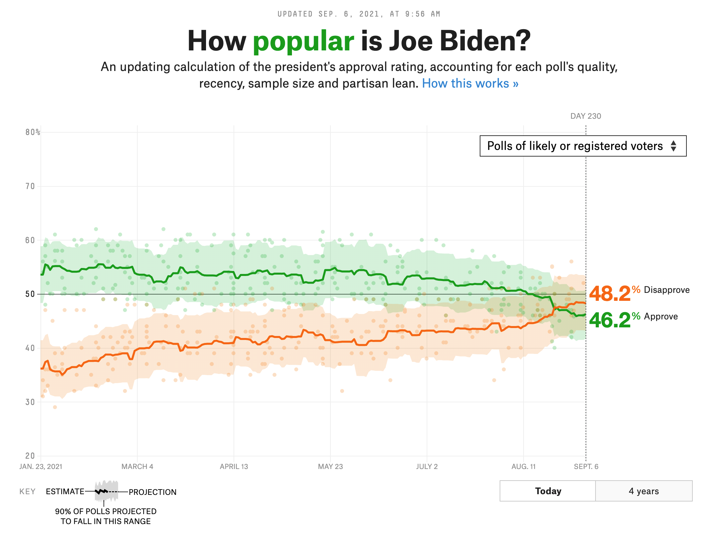

  
```{r child = "setup.Rmd"}
```
  
## Agenda

1.  Reshaping a single data frame
2.  Joining multiple data frames

## Announcements

1.  Office hours Friday moved to noon (or by appointment) and will be virtual.
<br>
1.  Make sure that you don't have any "M" status in your homework 1 -- these are files with modifications that haven't been pushed to github.  I have observed that some people  haven't pushed the .md files.
2.  If you are having troubles, I am available for consult after class.
3.  Remember that you can always make corrections to an assignment for partial credit.

---
class: middle

# .hand[We...]

.huge[.green[have]] .hand[unformatted or untidy data]

.huge[.pink[want]] .hand[to reorganize the data to carry on with our analysis]

---
class: code50
## Data: Sales

```{r include=FALSE}
library(tidyverse)
library(knitr)
customers = read_csv("l05a/data/sales/customers.csv")
prices = read_csv("l05a/data/sales/prices.csv")
```


<br>

.pull-left[
### .green[We have...]
.code50[
```{r echo=FALSE}
customers
```
]]

--
.pull-right[
### .pink[We want...]
```{r echo=FALSE}
customers %>%
  pivot_longer(cols = item_1:item_3, names_to = "item_no", values_to = "item")
```
]

---

## A grammar of data tidying

.pull-left[
```{r dplyr-part-of-tidyverse, echo=FALSE, out.width="60%", caption = "tidyr is part of the tidyverse"}
include_graphics("l05a/img/tidyr-part-of-tidyverse.png")
```
]
.pull-right[
The goal of tidyr is to help you tidy your data via

- **pivoting** between wide and long data
- splitting and combining character columns
- **nesting** and unnesting columns
- clarifying how `NA`s should be treated
]

---

class: middle

# Pivoting data

---

## Not this...

```{r echo=FALSE,out.width="70%"}
include_graphics("l05a/img/pivot.gif")
```

---

## but this!

.center[
```{r echo=FALSE, out.width="45%", out.extra ='style="background-color: #FDF6E3"'}
include_graphics("l05a/img/tidyr-longer-wider.gif")
```
]

---

## Wider vs. longer

.pull-left[
### .green[wider]
more columns
```{r echo=FALSE}
customers
```
]

--
.pull-right[
### .pink[longer]
more rows
```{r echo=FALSE}
customers %>%
  pivot_longer(cols = item_1:item_3, names_to = "item_no", values_to = "item")
```
]

---

## `pivot_longer()`

.pull-left[
- `data` (as usual)
]
.pull-right[
```{r eval=FALSE}
pivot_longer(
  data, #<<
  cols, 
  names_to = "name", 
  values_to = "value"
  )
```
]

---

## `pivot_longer()`

.pull-left[
- `data` (as usual)
- `cols`: columns to pivot into longer format 
]
.pull-right[
```{r eval=FALSE}
pivot_longer(
  data, 
  cols, #<<
  names_to = "name", 
  values_to = "value"
  )
```
]

---

## `pivot_longer()`

.pull-left[
- `data` (as usual)
- `cols`: columns to pivot into longer format 
- `names_to`: name of the column where column names of pivoted variables go (character string)
]
.pull-right[
```{r eval=FALSE}
pivot_longer(
  data, 
  cols, 
  names_to = "name", #<<
  values_to = "value"
  )
```
]

---

## `pivot_longer()`

.pull-left[
- `data` (as usual)
- `cols`: columns to pivot into longer format 
- `names_to`: name of the column where column names of pivoted variables go (character string)
- `values_to`: name of the column where data in pivoted variables go (character string)
]
.pull-right[
```{r eval=FALSE}
pivot_longer(
  data, 
  cols, 
  names_to = "name", 
  values_to = "value" #<<
  )
```
]

---

## Customers $\rightarrow$ purchases

```{r}
purchases = customers %>%
  pivot_longer( #<<
    cols = item_1:item_3,  # variables item_1 to item_3 #<<
    names_to = "item_no",  # column names -> new column called item_no #<<
    values_to = "item"     # values in columns -> new column called item #<<
    ) #<<

purchases
```

---
class: code50

## Why pivot?

Most likely, because the next step of your analysis needs it

--

.pull-left[
```{r}
prices
```
]
.pull-right[
```{r}
purchases %>%
  left_join(prices) #<<
```
]

.question[What role was item fulfilling when we joined prices to purchases?]

---

## Purchases $\rightarrow$ customers

.pull-left-narrow[
- `data` (as usual)
- `names_from`:  column in the long data pointing to the column names for the wide format
- `values_from`: column in the long data containing the values in the new columns for the wide format
]
.pull-right-wide[
```{r}
purchases %>%
  pivot_wider( #<<
    names_from = item_no, #<<
    values_from = item #<<
  ) #<<
```
]

---

class: middle

# Case study: Approval rating of Joseph Biden

---

```{r echo=FALSE, out.width="70%"}

```

.footnote[
Source: [FiveThirtyEight](https://projects.fivethirtyeight.com/biden-approval-rating/adults/)
]

---

## Data

```{r include=FALSE}
biden = read_csv("l05a/data/trump/biden.csv")
```

```{r}
biden
```

---

## Goal

.pull-left-wide[
```{r echo=FALSE, out.width="100%"}
biden %>%
  pivot_longer(
    cols = c(approval, disapproval),
    names_to = "rating_type",
    values_to = "rating_value"
  ) %>%
  ggplot(aes(x = date, y = rating_value, 
             color = rating_type, group = rating_type)) +
  geom_line() +
  facet_wrap(~ subgroup) +
  scale_color_manual(values = c("darkgreen", "orange")) + 
  labs( 
    x = "Date", y = "Rating", 
    color = NULL, 
    title = "How (un)popular is Joseph Biden?", 
    subtitle = "Estimates based on polls of all adults and polls of likely/registered voters", 
    caption = "Source: FiveThirtyEight modeling estimates" 
  ) + 
  theme_minimal() +
  theme(legend.position = "bottom")
```
]
--
.pull-right-narrow[
**Aesthetic mappings:**  
`r emo::ji("check")`  x = `date`  
`r emo::ji("x")`      y = `rating_value`  
`r emo::ji("x")`      color = `rating_type`

**Facet:**  
`r emo::ji("check")`  `subgroup` (Adults and Voters)
]

---

## Pivot

```{r output.lines=11}
biden_longer = biden %>%
  pivot_longer(
    cols = c(approval, disapproval),
    names_to = "rating_type",
    values_to = "rating_value"
  )

biden_longer
```

---

## Plot

```{r fig.asp = 0.5}
ggplot(biden_longer, 
       aes(x = date, y = rating_value, color = rating_type, group = rating_type)) +
  geom_line() +
  facet_wrap(~ subgroup)
```

---

.panelset[

.panel[.panel-name[Code]
```{r "biden-plot", fig.show="hide"}
ggplot(biden_longer, 
       aes(x = date, y = rating_value, 
           color = rating_type, group = rating_type)) +
  geom_line() +
  facet_wrap(~ subgroup) +
  scale_color_manual(values = c("darkgreen", "orange")) + #<<
  labs( #<<
    x = "Date", y = "Rating", #<<
    color = NULL, #<<
    title = "How (un)popular is Joseph Biden?", #<<
    subtitle = "Estimates based on polls of all adults and polls of likely/registered voters", #<<
    caption = "Source: FiveThirtyEight modeling estimates" #<<
  ) #<<
```
]

.panel[.panel-name[Plot]
```{r ref.label="biden-plot", echo = FALSE, out.width="75%"}
```
]

]

---

.panelset[

.panel[.panel-name[Code]
```{r "biden-plot-2", fig.show="hide"}
ggplot(biden_longer, 
       aes(x = date, y = rating_value, 
           color = rating_type, group = rating_type)) +
  geom_line() +
  facet_wrap(~ subgroup) +
  scale_color_manual(values = c("darkgreen", "orange")) + 
  labs( 
    x = "Date", y = "Rating", 
    color = NULL, 
    title = "How (un)popular is Joseph Biden?", 
    subtitle = "Estimates based on polls of all adults and polls of likely/registered voters", 
    caption = "Source: FiveThirtyEight modeling estimates" 
  ) + 
  theme_minimal() + #<<
  theme(legend.position = "bottom") #<<
```
]

.panel[.panel-name[Plot]
```{r ref.label="biden-plot-2", echo = FALSE, out.width="75%", fig.width=6}
```
]

]

---
class: font100, code50
## Your turn.

[Quiz 1](https://docs.google.com/forms/d/e/1FAIpQLSc_uw7gkcSP1hHi502dg6Nx-E1b1aFGYPY3t4dyZEySUiI5xw/viewform?usp=sf_link)

1. Suppose you have data (available with `library(tidyr)`) on TB incidence as follows:
```{r}
table2
```
Reshape this so that for each year and country, cases and population appear in separate columns.
2. Consider this table containing cases by year:
```{r}
table4a
```
Reshape this so that you can plot the year vs the case count with ggplot.

---

## Other tidyr functionality

* `nest()` and `unnest()` let you embed or expand list columns in a data frame.  .alert[This can be extremely powerful.] But it best illustrated with an example...in a couple weeks.
*  `fill()` imputes missing values by carrying observations down or up in a data frame
*  `complete()` makes implicit missing combinations of variables explicit.  Sometimes useful when building contingency tables.
*  `separate()` and `separate_rows()` can fix some issues with multiple values packed into the same cell of a table.

---

## `fill()`

```{r, echo = FALSE, include = FALSE}
sales = tibble::tribble(
  ~quarter, ~year, ~sales,
  "Q1",    2000,    66013,
  "Q2",      NA,    69182,
  "Q3",      NA,    53175,
  "Q4",      NA,    21001,
  "Q1",    2001,    46036,
  "Q2",      NA,    58842,
  "Q3",      NA,    44568,
  "Q4",      NA,    50197,
  "Q1",    2002,    39113,
  "Q2",      NA,    41668,
  "Q3",      NA,    30144,
  "Q4",      NA,    52897,
  "Q1",    2004,    32129,
  "Q2",      NA,    67686,
  "Q3",      NA,    31768,
  "Q4",      NA,    49094
)
options(pillar.print_max = 12, pillar.print_min = 12)
```

.pull-left[
```{r}
sales
```
]
.pull-right[
```{r}
sales %>% fill(year)
```
]

---

## `complete()`
```{r, echo = FALSE, include = FALSE}
df = tibble(
  group = c(1:2, 1),
  item_id = c(1:2, 2),
  value = 1:3
)
```

.pull-left[
```{r}
df
```
]
.pull-right[
```{r}
df %>% complete(group,item_id)

```
]

---

## `separate_rows()`

```{r, include = FALSE}
df = tibble(
  x = 1:3,
  y = c("a", "d,e,f", "g,h"),
  z = c("1", "2,3,4", "5,6")
)
```
.pull-left[
```{r}
df
```
]
.pull-right[
```{r}
separate_rows(df, y, z, convert = TRUE)
```
]

---
class: code70

## `separate()`

.pull-left[
```{r}
df
```
]

.pull-right[
```{r}
separate(df, y, c('y1', 'y2', 'y3'))
```
]

---

class: middle

# Merging data frames

---

class: middle

# .hand[We...]

.huge[.green[have]] .hand[multiple data frames]

.huge[.pink[want]] .hand[to bring them together]

---

```{r include=FALSE}
professions = read_csv("l05a/data/scientists/professions.csv")
dates = read_csv("l05a/data/scientists/dates.csv")
works = read_csv("l05a/data/scientists/works.csv")
```

## Data: Women in science 

Information on 10 women in science who changed the world

.small[
```{r echo=FALSE}
professions %>% select(name) %>% kable()
```
]


.footnote[
Source: [Discover Magazine](https://www.discovermagazine.com/the-sciences/meet-10-women-in-science-who-changed-the-world)
]

---

## Inputs

.panelset[

.panel[.panel-name[professions]
```{r}
professions
```
]

.panel[.panel-name[dates]
```{r}
dates
```
]

.panel[.panel-name[works]
```{r}
works
```
]

]

---

## Desired output

```{r echo=FALSE}
professions %>%
  left_join(dates) %>%
  left_join(works)
```

---

## Inputs, reminder

.pull-left[
```{r}
names(professions)
names(dates)
names(works)
```
]
.pull-right[
```{r}
nrow(professions)
nrow(dates)
nrow(works)
```
]

---

class: middle

# Joining data frames

---

## Joining data frames

```{r eval=FALSE}
something_join(x, y)
```

- `left_join()`: all rows from x
- `right_join()`: all rows from y
- `full_join()`: all rows from both x and y
- `semi_join()`: all rows from x where there are matching values in y, keeping just columns from x
- `inner_join()`: all rows from x where there are matching values in y, return 
all combination of multiple matches in the case of multiple matches
- `anti_join()`: return all rows from x where there are not matching values in y, never duplicate rows of x
- ...
 
---

## Setup

For the next few slides...

.pull-left[
```{r echo=FALSE}
x = tibble(
  id = c(1, 2, 3),
  value_x = c("x1", "x2", "x3")
  )
```
```{r}
x
```
]
.pull-right[
```{r echo=FALSE}
y = tibble(
  id = c(1, 2, 4),
  value_y = c("y1", "y2", "y4")
  )
```
```{r}
y
```
]

---

## `left_join()`

.pull-left[
```{r echo=FALSE, out.width="80%", out.extra ='style="background-color: #FDF6E3"'}
include_graphics("l05a/img/left-join.gif")
```
]
.pull-right[
```{r}
left_join(x, y)
```
]

---

## `left_join()`

```{r}
professions %>%
  left_join(dates) #<<
```

---

## `right_join()`

.pull-left[
```{r echo=FALSE, out.width="80%", out.extra ='style="background-color: #FDF6E3"'}
include_graphics("l05a/img/right-join.gif")
```
]
.pull-right[
```{r}
right_join(x, y)
```
]

---

## `right_join()`


```{r}
professions %>%
  right_join(dates) #<<
```

---

## `full_join()`

.pull-left[
```{r echo=FALSE, out.width="80%", out.extra ='style="background-color: #FDF6E3"'}
include_graphics("l05a/img/full-join.gif")
```
]
.pull-right[
```{r}
full_join(x, y)
```
]

---

## `full_join()`

```{r}
dates %>%
  full_join(works) #<<
```

---

## `inner_join()`

.pull-left[
```{r echo=FALSE, out.width="80%", out.extra ='style="background-color: #FDF6E3"'}
include_graphics("l05a/img/inner-join.gif")
```
]
.pull-right[
```{r}
inner_join(x, y)
```
]

---

## `inner_join()`

```{r}
dates %>%
  inner_join(works) #<<
```

---

## `semi_join()`

.pull-left[
```{r echo=FALSE, out.width="80%", out.extra ='style="background-color: #FDF6E3"'}
include_graphics("l05a/img/semi-join.gif")
```
]
.pull-right[
```{r}
semi_join(x, y)
```
]

---

## `semi_join()`

```{r}
dates %>%
  semi_join(works) #<<
```

---

## `anti_join()`

.pull-left[
```{r echo=FALSE, out.width="80%", out.extra ='style="background-color: #FDF6E3"'}
include_graphics("l05a/img/anti-join.gif")
```
]
.pull-right[
```{r}
anti_join(x, y)
```
]

---

## `anti_join()`

```{r}
dates %>%
  anti_join(works) #<<
```

---

## Putting it altogether

```{r}
professions %>%
  left_join(dates) %>%
  left_join(works)
```

---

class: middle

# Case study: Student records

---

## Student records

- Have:
  - Enrollment: university records
  - Survey: Student-provided. Missing students who never filled it out. Includes students who dropped the class
- Want: Survey info for all enrolled in class 

--

```{r include=FALSE}
enrollment = read_csv("l05a/data/students/enrolment.csv")
survey = read_csv("l05a/data/students/survey.csv")
```

.pull-left[
```{r message = FALSE}
enrollment
```
]
.pull-right[
```{r message = FALSE}
survey
```
]

---

## Student records

.panelset[

.panel[.panel-name[In class]
```{r}
enrollment %>% 
  left_join(survey, by = "id") #<<
```
]

.panel[.panel-name[Survey missing]
```{r}
enrollment %>% 
  anti_join(survey, by = "id") #<<
```
]

.panel[.panel-name[Dropped]
```{r}
survey %>% 
  anti_join(enrollment, by = "id") #<<
```
]

]

---
class: code50

## Specify key(s) with `by`

.pull-left[
```{r, message = TRUE}
left_join(enrollment, survey)
```
.question[What happened?]
]

--

.pull-right[
```{r, message = TRUE}
left_join(enrollment, survey, by = 'id')
```
]

---

## Specify the joining key(s) with `by`

Can also provide the mapping between keys with 
```r
something_join(x, y, c(xkey1 = 'ykey1', xkey2 = 'ykey2'))
```

```{r}
survey_rn = survey %>% rename(survey_id = id, first_name = name)
survey_rn
```

---
class: code50

## Specifying joining keys with `by`

.pull-left[
Enrollment on left, `left_join`
```{r}
left_join(enrollment, survey_rn, by = c(id = "survey_id"))
```
]

.pull-right[
Enrollment on right, `right_join`
```{r}
right_join(survey_rn, enrollment, by = c(survey_id = "id"))
```
]

.question[What is similar and what is different about this?]

--

.alert[Punchline: same column names should imply same key type!] (Converse need not hold.)
---

class: middle

# Case study: Grocery sales

---
class: code70
## Grocery sales

- Have:
  - Purchases: One row per customer per item, listing purchases they made
  - Prices: One row per item in the store, listing their prices
- Want: Total revenue

--

```{r include=FALSE}
purchases = read_csv("l05a/data/sales/purchases.csv")
prices = read_csv("l05a/data/sales/prices.csv")
```

.pull-left[
```{r message = FALSE}
purchases
```
]
.pull-right[
```{r message = FALSE}
prices
```
]

---
class: code70

## Grocery sales

.panelset[

.panel[.panel-name[Total revenue]
.pull-left[
```{r}
purchases %>% 
  left_join(prices) #<<
```
]
.pull-right[
```{r}
purchases %>% 
  left_join(prices) %>%
  summarise(total_revenue = sum(price)) #<<
```
]
]

.panel[.panel-name[Revenue per customer]

.pull-left[
```{r}
purchases %>% 
  left_join(prices)
```
]
.pull-right[
```{r}
purchases %>% 
  left_join(prices) %>%
  group_by(customer_id) %>% #<<
  summarise(total_revenue = sum(price))
```
]

]

]

---

## `nycflights13` relational data
```{r, include= FALSE}
library(nycflights13)
options(pillar.print_max = 6, pillar.print_min = 6)

```
.panelset[

.panel[.panel-name[airlines]
Full carrier name from abbreviation
```{r}
airlines
```
]
.panel[.panel-name[airports]
Information about each airport, identified by `faa` code:
```{r}
airports
```
]
.panel[.panel-name[planes]
information about each plane, identified by its `tailnum`:
```{r}
planes
```
]
.panel[.panel-name[weather]
Weather at each NYC airport for each hour:
```{r}
weather
```
]
]
---

## A relational diagram

.pull-left[
Each relation always concerns a pair of tables.

* `flights` connects to `planes` via a single variable, `tailnum`. 
* `flights` connects to `airports` in two ways: via the `origin` and
  `dest` variables.
* `flights` connects to `weather` via `origin` (the location), and
  `year`, `month`, `day` and `hour` (the time).
]
.pull-right[

]
---

## Your turn

[Quiz 2](https://docs.google.com/forms/d/e/1FAIpQLSeQnfY6QXsXhIomcQ92dW70DSpYtZq-Yql4dlUvIUrE7FwYZg/viewform?usp=sf_link)

1.  Imagine you wanted to draw (approximately) the route each plane flies from
    its origin to its destination. What variables would you need? What tables
    would you need to combine?

---
## Full solution

[code](l05a/flights_join.R)

---
## Keys


The variables that connect pairs of tables are called __keys__. A key is a variable (or set of variables) that uniquely identifies an observation. 

For example, each plane is uniquely identified by its `tailnum`, but identify an observation in `weather` you need five variables: `year`, `month`, `day`, `hour`, and `origin`.

There are two types of keys:

* A __primary key__ uniquely identifies an observation in its own table.
  For example, `planes$tailnum` is a primary key because it uniquely identifies
  each plane in the `planes` table.

* A __foreign key__ uniquely identifies an observation in another table.
  For example, the `flights$tailnum` is a foreign key because it appears in the 
  `flights` table where it matches each flight to a unique plane.

---
class: code70
## Keys

The uniqueness of the keys is an invariant.  Let's test it: 

```{r}
planes %>% 
  count(tailnum) %>% 
  filter(n > 1)

weather %>% 
  count(year, month, day, hour, origin) %>% 
  filter(n > 1)
```
.question[What happened at 1AM on November 3rd?]
---
class: code70

## Where's the primary key in `flights`?

.pull-left[
Is he in the flight number?
```{r}
flights %>% 
  count(year, month, day, flight) %>% 
  filter(n > 1)
```
Nope.
]
.pull-right[
Is he hiding in the plane tailnum?
```{r}
flights %>% 
  count(year, month, day, tailnum) %>% 
  filter(n > 1)
```
Not here either.
]

---

## There he is!

```{r}
flights %>% 
  count(year, month, day, flight, origin, carrier) %>% 
  filter(n > 1)
```

It always pays to ask (but verify!)

---

## Surrogate keys

If a table lacks a primary key, it's often useful to add one with `mutate()` and `row_number()`. That makes it easier to match observations if you've done some filtering and want to check back in with the original data. This is called a __surrogate key__.


---

## A tiny bit of database theory

Tidy data sets will obey [various .alert[normal forms]](https://en.wikipedia.org/wiki/Database_normalization).  The most basic is that there exists a .alert[primary keys] obeying a uniqueness and existence constraint.

Highly normalized data sets also obey redundancy constraints that entail factoring (dividing) a data set into multiple tables. Unless you are a database engineer,  complete normalization is often just a stumbling block to analyze data.  

However, it can be very helpful to think about dividing data into a primary table of **facts**, and auxiliary tables of **dimensions**.  The facts represent frequently-updated observations and the dimensions are covariates that can be shared across observations and should change slowly, if at all.<sup>1</sup>

.footnote[[1] See Kimball and Ross. *The Data Warehouse Toolkit* for details.  It's surprisingly interesting and relevant.]


---

# Class survey

[How are things going so far?]( https://docs.google.com/forms/d/e/1FAIpQLSc2ThD_7Q9yCWJs5ucHpnVeDg9JougMe7shI__Wb332UmAVzg/viewform?usp=sf_link)

---
# Acknowledgments

Adapted from Data science in a box: 
[1](https://rstudio-education.github.io/datascience-box/course-materials/slides/u2-d09-tidying/u2-d09-tidying.html#1)
[2](https://rstudio-education.github.io/datascience-box/course-materials/slides/u2-d08-multi-df/u2-d08-multi-df.html#1)


