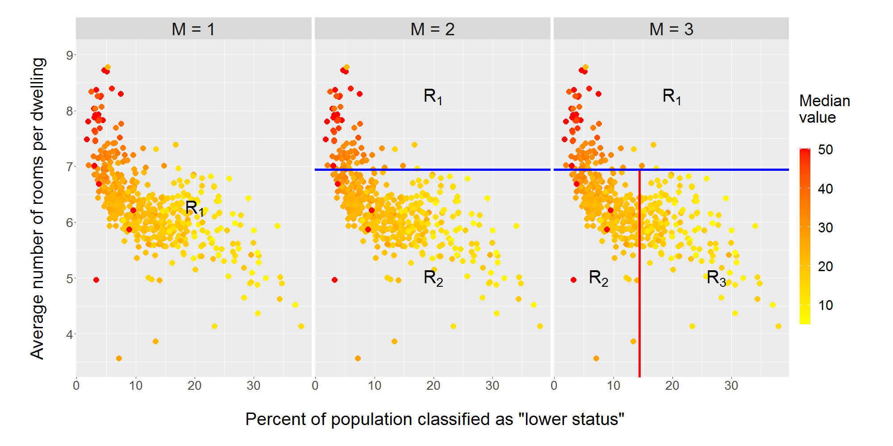
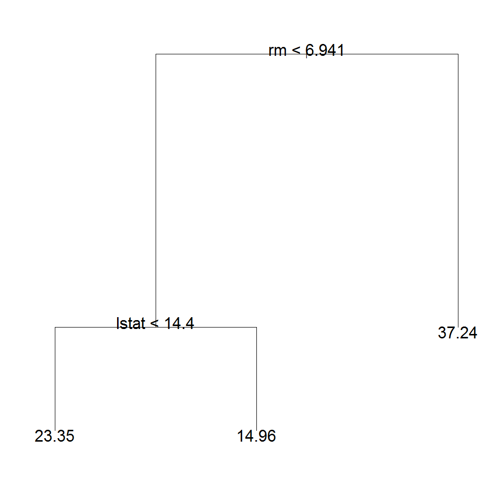
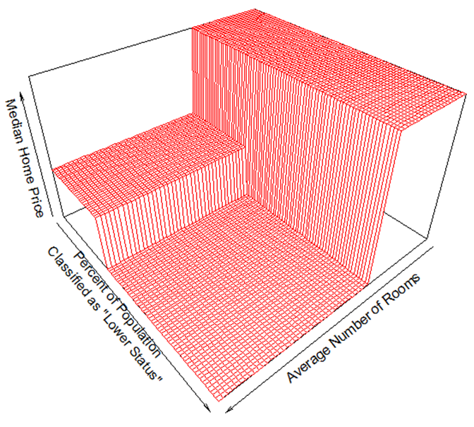

  
```{r child = "setup.Rmd"}
```

```{r, include = FALSE}
knitr::opts_chunk$set(cache = TRUE, autodep = TRUE, warnings=FALSE)
library(tidyverse)
library(tidymodels)
library(ggplot2)
library(mlbench)
set.seed(1234)
options(
  warnPartialMatchArgs = FALSE,
  warnPartialMatchAttr = FALSE, 
  warnPartialMatchDollar = FALSE,
  width = 100
)
```

# Overview

*  Tree learners (CART)
*  Bootstrap Aggregation (Bagging)
*  Random Subspaces
*  Random Forests
*  Boosting
*  Bayesian Ensembles of trees (BART)
*  Grafted and Vanishing Random Subspaces
  
Here's the [R code in this lecture](l20-trees-and-forests_files/l20-trees-and-forests.R)

---
  
## Classification and Regression Trees (CART)

.pull-left[
Proposed by Leo Breiman in 1984
_Problem_: Linear regression models often perform poorly with complex real-world data

_Idea_: Try fitting simple regression models to different partitions of the covariate space to achieve a better fit

_Solution_: Partition up the covariate space using a binary classification tree and fit a model to each subspace
]
.pull-right[
```{r echo=FALSE, out.width="100%", fig.align="right"}
knitr::include_graphics("l20/Leo_Breiman.jpg")
```
]

---

## Growing a Regression Tree:

*The data consists of $p$ inputs and a response for each of $N$ observations, that is, $(x_i,y_i)$ for $i = 1,\dots, N$, with $x_i = (x_{i1}, \dots, x_{ip})$

*The algorithm sequentially identifies a variable on which to make a split/partition as well as the respective split point/value

*CART partitions the covariate space into $M$ distinct, non-overlapping regions $R_1, \dots, R_M$ and we model the response as a constant $\gamma_m$ in each of the regions as follows:

$$
T(x) = \sum_{m=1}^M \gamma_m I(x \in R_m)
$$

---

## Boston Housing Data Example
    
```{r echo=FALSE, out.width="100%", fig.align="right"}

```
*
---

```{r}
library(mlbench) #you probably need to install thsi library
data("BostonHousing")
names(BostonHousing)

ggplot(BostonHousing, aes(x=lstat, y=rm, color=medv)) +
geom_point()
```
---

## Boston Housing Data Tree

.pull-left[
* The first split $(\# \text{rooms} < 6.941)$ partitions the space into $R_1$ and $R_2$ 
* The second split $(\% \text{lower status})$ further divides up the $R_2$ subspace
]
.pull-right[
```{r echo=FALSE, out.width="100%", fig.align="right"}

```
]

---

## Boston Housing Data Tree

.pull-left[
* The solution that minimizes the sum of squared errors uses the average of the $y_i$ in the region $R_m$ as the estimates for the $\gamma_m$'s
$$
\hat{\gamma}_m = \text{ave}(y_i|x_i \in R_M)
$$
]
.pull-right[
```{r echo=FALSE, out.width="100%", fig.align="right"}

```
]

---

## How do we pick the splits?:

* Consider a split variable $k$ and value at which to split it $s$ and define the pair of half-planes
\begin{equation}
\underset{k,s}{\operatorname{min}} \Bigg[
\underset{\gamma_1}{\operatorname{min}}
\sum_{x_i \in R_1(k,s)} (y_i-\gamma_1)^2 +
\underset{\gamma_2}{\operatorname{min}}
\sum_{x_i \in R_2(k,s)} (y_i-\gamma_2)^2\Bigg]
\end{equation}
* Inner minimization is solved by $\hat{\gamma}_1 = \text{ave}(y_i|x_i \in R_1(k,s))$ and $\hat{\gamma}_2 = \text{ave}(y_i|x_i \in R_2(k,s))$
* The partition is made on the best available split (greedy) identified using equation 2, then the process is repeated 

---

## How/when do we stop?: Cost-Complexity Pruning

* Add up all the squared deviations from the leaf-level estimates
* Add a penalty that grows with the number of partitions
* Minimize the penalized sum of deviations

\begin{equation}
\sum_{m=1}^{|M|} \sum_{x_i \in R_m} (y_i - \hat{\gamma}_m)^2 + \alpha |M|
\end{equation}

---

```{r warning = FALSE}
library(rpart) #you probably need to install this library
#rpart(medv ~., data = BostonHousing, control = rpart.control(maxdepth = 2))
rpart(medv ~., data = BostonHousing, control = rpart.control(cp = .1))
set.seed(1234)
BostonSplit = initial_split(BostonHousing, prop=0.80)
trained1 = rpart(medv ~., data = training(BostonSplit), control = rpart.control(cp = .1))
cat("\n Sum Squared Error for one Tree", sum((predict(trained1, testing(BostonSplit)) - testing(BostonSplit)$medv)^2),"\n")
```

---

## Ensemble Methods

_Ensemble learning_: methods that join together *simple* models or *weak* learners to form a committee or ensemble

* Ensembles leverage the combined strength of their base models to achieve increased predictive performance greater than that of the individual learners

* Generally speaking, ensembles are made stronger when there is disagreement and very little correlation among the learners

* "Diversity and independence are important because the best collective decisions are the product of disagreement and contest, not consensus or compromise." -James Surowiecki, The Wisdom of Crowds

---

## Bootstrap Aggregation (Bagging)
    

* Ensemble procedure that reduces variance in the estimate $\hat{f}(x)$ by averaging over predictions from individual trees (bias unchanged)

* Bagging with trees:

 * Draw $B$ bootstrapped samples from the data $\boldsymbol{Z} = \{(x_1,y_1), \dots, (x_n,y_n)\}$
 * For each bootstrap sample $\boldsymbol{Z}_{b}$,  $b = 1,\dots,B$, fit a tree $T(x; \theta_b)$ and obtain predictions, then average predictions across trees:
\begin{equation}
\hat{f}_\text{Bagged}(x) = 
\frac{1}{B} \sum_{b=1}^B T(x; \theta_b),
\end{equation}
where $\theta_b$ characterizes the $b^\text{th}$ tree (split variables, cut points, terminal node values)

---

```{r warning = FALSE}
library(ipred) #you probably need to install this library
bagging(medv ~., data = BostonHousing, nbagg=100)
#bagging(medv ~., data = BostonHousing, nbagg=100)$mtrees[[25]]$btree

trained2 = bagging(medv ~., data = training(BostonSplit), nbagg=100)
cat("\n Sum Squared Error for Bagging", sum((predict(trained2, testing(BostonSplit)) - testing(BostonSplit)$medv)^2),"\n")

```

---

## Random Subspaces
    
* Proposed by Tin Kam Ho in 1998, also known as "attribute bagging"

* Random subspaces with trees:

    * Draw $B$ randomly chosen subsets of the predictor variables (referred to as "feature subsets") from the data, each of size  $r < p$
    * For each feature subset $X^{b}_{\{n \times r\}}$ $b = 1,\dots,B$ fit a tree $T(x; \theta_b)$ and obtain the predictions, then average predictions over trees:
\begin{equation}
\small
\hat{f}_\text{RSM}(x) = 
\frac{1}{B} \sum_{b=1}^B T(x; \theta_b)
\end{equation}

* Building trees on different feature subsets can reduce correlation between trees making for a stronger ensemble

---

## Random Forests
    
* Proposed by Leo Breiman in 2001

* RF both bootstraps the data and the attributes

* Improves the variance reduction of bagging by reducing correlation among trees in the ensemble
* Draw $B$ bootstrapped samples from the data $\boldsymbol{Z} = \{(x_1,y_1), \dots, (x_n,y_n)\}$
* For each bootstrap sample $\boldsymbol{Z}_{b}$, $b = 1,\dots,B$,
    * select mtry$=r$ of the variables  $X^{b}_{\{n \times r\}}$
    * fit a tree $T(x; \theta_b)$, with mtry candidate variables
    * obtain the predictions, then average predictions over trees:
\begin{equation}
\small
\hat{f}_\text{RF}(x) = 
\frac{1}{B} \sum_{b=1}^B T(x; \theta_b)
\end{equation}

---

```{r warning = FALSE}
library(randomForest) #you probably need to install this library
randomForest(medv ~., data = BostonHousing, mtry=4)

trained3 = randomForest(medv ~., data = training(BostonSplit), mtry=3)
cat("\n Sum Squared Error for randomForest", sum((predict(trained3, testing(BostonSplit)) - testing(BostonSplit)$medv)^2),"\n")
```

---

## Boosting
    
* Propsed by Robert Schapire in 1990, sum of trees ensemble

* Fit tree $T(x, \theta_b)$ to residuals from ensemble consisting of all trees that came before it (instead of $y$):
\begin{equation}
\small
\hat{\theta_b} =
\underset{\theta_b}{\operatorname{argmin}}
\Bigg[
\sum_{i = 1}^n L(y_i, f_{b-1}(x_i) +
T(x_i, \theta_b))
\Bigg],
\end{equation}

* Fitting each tree to ensemble residuals allows ensemble to improve in areas where it performs poorly

* Boosted tree model is the sum over these trees
\begin{equation}
\hat{f}_\text{Boost}(x) = \sum_{b=1}^B T(x; \theta_b)
\end{equation}

---

## Boosting

* Shrunken version of new tree is added to the ensemble
\begin{equation}
f_b(x) = f_{b-1}(x) + \omega T(x_i, \theta_b)
\end{equation}
\begin{equation}
\hat{f}_\text{Boost}(x) = \sum_{b=1}^B \omega T(x; \theta_b)
\quad 0 \le \omega \le 1
\end{equation}

* Shrinkage prevents any one tree from being overly influential

* Shrinkage parameter $\omega$ controls rate at which boosting learns (smaller $\omega$ values with large forests sizes tend to work well)

---

```{r warning = FALSE}
library(mboost) #you probably need to install this library
blackboost(medv ~., data = BostonHousing, control = boost_control(mstop = 50))

trained4 = blackboost(medv ~., data = training(BostonSplit))
cat("Sum Squared Error for Boosting", sum((predict(trained4, testing(BostonSplit)) - testing(BostonSplit)$medv)^2),"\n")
```

---

## Combining Ensemble Methods
    
* Much work has been done in combining data-partitioning methods with feature-partitioning methods and also with boosting

```{r echo=FALSE, out.width="100%", fig.align="right"}
knitr::include_graphics("l20/Algorithm_Map.PNG")
```

---

##  Bayesian Additive Regression Trees (BART) 

* Instead of fitting a greedy optimizer to a tree, we can put a prior distribution on trees and get a posterior distribution for the tree

* If we build an ensemble of Bayesian trees in the right way, we get a BART model

* Details omitted

---

```{r warning = FALSE}
library(dbarts) #you probably need to install this library
set.seed(99)
bartFit <- dbarts::bart(BostonHousing[-14], BostonHousing$medv)
```
---

```{r}
plot(bartFit)

trained5 = dbarts::bart(training(BostonSplit)[-14], training(BostonSplit)$medv, 
              keeptrees = TRUE) # must keep trees to do predictions
cat("\n Sum Squared Error for BART", sum((colMeans(predict(trained5, testing(BostonSplit))) - testing(BostonSplit)$medv)^2),"\n")

```

---

```{r echo = FALSE}
cat("\n Sum Squared Error for one Tree", sum((predict(trained1, testing(BostonSplit)) - testing(BostonSplit)$medv)^2),"\n")
cat("\n Sum Squared Error for Bagging", sum((predict(trained2, testing(BostonSplit)) - testing(BostonSplit)$medv)^2),"\n")
cat("\n Sum Squared Error for randomForest", sum((predict(trained3, testing(BostonSplit)) - testing(BostonSplit)$medv)^2),"\n")
cat("\n Sum Squared Error for Boosting", sum((predict(trained4, testing(BostonSplit)) - testing(BostonSplit)$medv)^2),"\n")
cat("\n Sum Squared Error for BART", sum((colMeans(predict(trained5, testing(BostonSplit))) - testing(BostonSplit)$medv)^2),"\n")
```

---

## Grafting and Vanishing Random Subspaces

_Problem_:

* Procedures that use random sampling of the input variables for split candidates (e.g. Random Forests, RSM) suffer when the number of truly informative features $s$ is small relative to $p$

* Feature (input variable) subsets are likely to contain many non-informative features

* Learners built on these subsets can be harmful to ensemble

_Solution_:

* Allow each tree to share information regarding variable importance in its feature subset with the trees that come after it in the ensemble


---

# Acknowledgments

Adapted from Matthew Corsetti's [Thesis](https://www.urmc.rochester.edu/education/graduate/statistics-and-facts/2021-2022-thesis-titles.aspx)

Simplilearn [Lesson 8](https://www.simplilearn.com/tutorials/data-science-tutorial/random-forest-in-r) 

## Resources

- [Hands-On Machine Learning with R](https://bradleyboehmke.github.io/HOML/random-forest.html) by Bradley Boehmke & Brandon Greenwell

---

## References
* Breiman, L., Friedman, J. H., Olshen, R. A., & Stone, C. J. (1984). Classification and regression trees. Boca Raton, FL: CRC Press.
* Ho, T. K. (1995). Random Decision Forests.Proceedings of the 3rd International Conference on Document Analysis and Recognition, 278-282.
* Hastie, T., Tibshirani, R., & Friedman, J. H. (2004). The elements of statistical learning: Data mining, inference, and prediction: With 200 full-color illustrations. New York: Springer.
* Schapire, R. E. (1990). The strength of weak learnability. Machine Learning, 5(2), 197-227.
* Corsetti M. A. &  Love T. M. (2022).Grafted and Vanishing Random Subspaces. Pattern Anal Appl. 25(1), 89-124.

