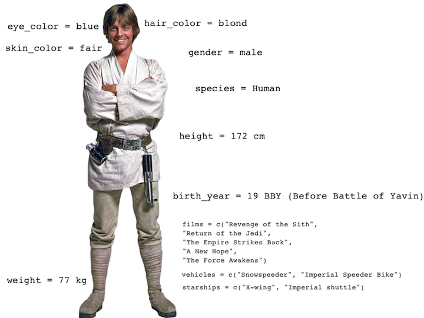
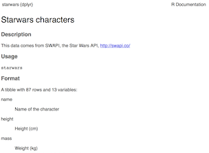
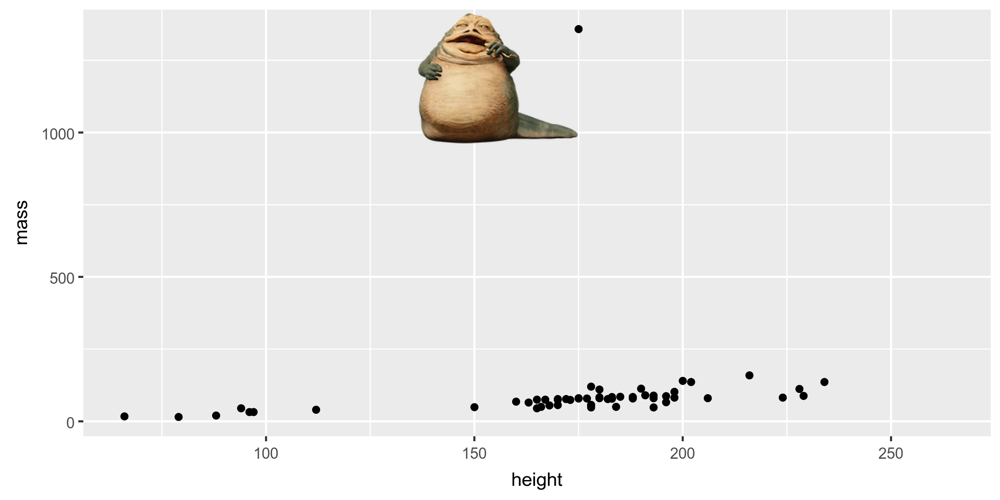

  
```{r setup, include=FALSE}
# R options
options(
  htmltools.dir.version = FALSE, # for blogdown
  show.signif.stars = FALSE     # for regression output
)
# Set dpi and height for images
library(knitr)
opts_chunk$set(fig.height = 2.5, dpi = 300) 
# ggplot2 color palette with gray
color_palette <- list(gray = "#999999", 
                      salmon = "#E69F00", 
                      lightblue = "#56B4E9", 
                      green = "#009E73", 
                      yellow = "#F0E442", 
                      darkblue = "#0072B2", 
                      red = "#D55E00", 
                      purple = "#CC79A7")
# For nonsese...
#library(emo)
htmltools::tagList(rmarkdown::html_dependency_font_awesome())
```

## Agenda

- Exploratory data analysis
- Data visualization
- Visualizing Star Wars
- Aesthetics
- Faceting
- Identifying variables
- Visualizing numerical data
- Visualizing categorical data

---

class: center, middle

# Exploratory data analysis

---

## What is EDA?


- Exploratory data analysis (EDA) is an approach to analyzing data sets to summarize its main characteristics.

- Often, this is visual. That's what we're focusing on today.

- But we might also calculate summary statistics and perform data wrangling/manipulation/transformation at (or before) this stage of the analysis.

---

class: center, middle

# Data visualization

---

## Data visualization

> *"The simple graph has brought more information to the data analyst’s mind than any other device." — John Tukey*

- Data visualization is the creation and study of the visual representation of data.
- There are many tools for visualizing data (R is one of them), and many approaches/systems within R for making data visualizations (**ggplot2** is one of them, and that's the one we're going to use).

---

## ggplot2, part of the tidyverse

- ggplot2 is a data visualization package
<!-- - To use ggplot2 functions, first load tidyverse -->
```{r, message = FALSE, results = 'hide', echo =  2, warning=FALSE}
suppressPackageStartupMessages(library(tidyverse))
library(tidyverse)
```
- In ggplot2 the structure of the code for plots can often be summarized as
```{r eval = FALSE}
ggplot + 
  geom_xxx
```
where geoms (geometric objects) describe the type of plot produced. Example:

.small[
```{r eval = FALSE}
ggplot(data = [dataset], mapping = aes(x = [x-variable], y = [y-variable])) +
   geom_xxx() +
   other options
```
]

---

## About ggplot2

- ggplot2 is the name of the package
- The `gg` in "ggplot2" stands for Grammar of Graphics
- Inspired by the book **Grammar of Graphics** by Leland Wilkinson
- The main idea is to build plots in a structured manner by layering components.

---

## Layering

- Start with data that you want to generate plots from.
- Specify the aesthetics, typically these are variables (columns) in your data.
- Specify the geometric objects, points, lines, bars, boxplots, etc.
- Add scales, facets, themes, color scales, labels, etc.

---

## Layering

```{r eval = FALSE}
ggplot(data = <DATA>) + 
  <GEOM_FUNCTION>(
     mapping = aes(<MAPPINGS>),
     stat = <STAT>, 
     position = <POSITION>
  ) +
  <COORDINATE_FUNCTION> +
  <FACET_FUNCTION>`
```

- `ggplot()` is the main function in ggplot2
- Every geom has different mapping available.
- For full reference of the geoms and mappings, see http://ggplot2.tidyverse.org/
- Note the "+" at the end of the line lets ggplot know when to stop adding components

---

## Back in the days of base R graphics...

- Plots are built in an ad-hoc manner.
- No fixed data set or aesthetics -- data to be plotted are passed in externally.
- Requires more work to polish the figure and generating multi-panel figures (faceted plots).
- Most often require different syntax and code (poor reproducibility)
- One of the lab questions will ask you to produce a plot using base R graphics and ggplot2.

---

class: center, middle

# Visualizing Star Wars

---

## Dataset terminology

&nbsp;
.scroll-box-14[
```{r}
starwars
```
]

<div class="question">
What does each row represent? What does each column represent?
</div>

---

## Luke Skywalker



---

## What's in the Star Wars data?

Take a `glimpse` at the data:
.scroll-box-14[
```{r}
glimpse(starwars)
```
]

---

## What's in the Star Wars data?

Run the following **in the Console** to view the help
```{r eval = FALSE}
?starwars
```



<div class="question">
How many rows and columns does this dataset have? What does each row represent? What does each column represent?
</div>


<div class="question">
Make a prediction: What relationship do you expect to see between height and mass?
</div>

---

## Danged computer, stop doing what I tell you to do.

<div class = "middle">
<div class="question">
What will happen if you entered this into the Console:
</div>

```{r, eval = FALSE}
glimpse(Starwars)
```

--

```{r, error = TRUE}
glimpse(Starwars)
```

--

.alert[R is case sensitive!]
</div>
---

## Mass vs. height

```{r fig.width = 7, fig.height=3}
ggplot(data = starwars, mapping = aes(x = height, y = mass)) +
  geom_point()
```

---

## What's that warning?

--

- Not all characters have height and mass information (hence 28 of them not plotted)

```
## Warning: Removed 28 rows containing missing values (geom_point).
```

- Going forward I'll suppress the warning to save room on slides, but it's important to note it

- **Warnings** mean the author thinks something funny is happening
  - sometimes adding an explicit argument makes them go away

- **Errors** stop R from working

---

## Mass vs. height

<div class="question">
How would you describe this relationship? What other variables would help us understand data points that don't follow the overall trend? Who is the not so tall but really chubby character?
</div>

```{r fig.width = 7, fig.height=3, echo=FALSE, warning=FALSE}
ggplot(data = starwars, mapping = aes(x = height, y = mass)) +
  geom_point()
```

---

## Jabba!

```{r echo=TRUE, warning=FALSE}
starwars$name[starwars$mass>1000&!is.na(starwars$mass)]
```
```{r echo=FALSE, warning=FALSE}
# jabba <- image_read("l04/img/jabba.png")

# fig <- image_graph(width = 2400, height = 1200, res = 300)
# ggplot(data = starwars, mapping = aes(x = height, y = mass)) +
#  geom_point()
# dev.off()

# out <- fig %>% image_composite(jabba, offset = "+1000+30")

# image_write(out, "l04/img/jabbaplot.png", format = "png")

```

---

## Mass vs. height: your turn

- Load `dplyr` and the `starwars` data. 
- Plot mass vs height without Jabba.

---

## Additional variables

The scatter plot shows two (continuous) variables.

We can display additional variables with

- aesthetics (shape, colour, size), or
- faceting (small multiples displaying different subsets)

---

class: center, middle

# Aesthetics

---

## Aesthetics options

.alert[Aesthetics] are visual characteristics of the `geom_point`  that can be **mapped to data**:

- `color`
- `size`
- `shape`
- `alpha` (transparency)

--
- ...and some lesser used ones: `fill`, `stroke`

--
- ...and `group`.  This one is most useful in settings where you have multiple observations from the same group (e.g., repeated measurements from an individual and want to make a line plot).

---

## Mass vs. height + gender

```{r fig.width = 8, fig.height=3, warning=FALSE}
starwars_wo_jabba <- starwars[!grepl("Jabba", starwars$name),]
ggplot(data = starwars_wo_jabba, mapping = aes(x = height, y = mass, color = gender)) +
  geom_point()
```

---

## Aesthetics summary

aesthetics    | discrete     | continuous
------------- | ------------ | ------------
color         | rainbow of colors | gradient
size          | discrete steps    | linear mapping between radius and value
shape         | different shape for each | shouldn't (and doesn't) work

---

class: center, middle

# Faceting

---

## Faceting options

- Smaller plots that display different subsets of the data

- Useful for exploring conditional relationships and large data

---

## Mass vs. height by gender

.small[
```{r fig.height=3, fig.width=8, warning=FALSE}
ggplot(data = starwars, mapping = aes(x = height, y = mass)) +
  facet_grid(. ~ gender) +
  geom_point()
```
]

---

## Dive further...

<div class="question">
In the next few slides describe what each plot displays. Think about
how the code relates to the output.
</div>

---

## Code 1

```{r, eval=FALSE}
ggplot(data = starwars, mapping = aes(x = height, y = mass)) +
  geom_point() +
  facet_grid(gender ~ .)
```

---

## Plot 1

```{r fig.height=4, fig.width=7, warning=FALSE, echo=FALSE}
ggplot(data = starwars, mapping = aes(x = height, y = mass)) +
  geom_point() +
  facet_grid(gender ~ .)
```

---

## Code 2

```{r, eval=FALSE}
ggplot(data = starwars, mapping = aes(x = height, y = mass)) +
  geom_point() +
  facet_grid(. ~ gender)
```

---

## Plot 2

```{r fig.width=7, warning=FALSE, echo=FALSE}
ggplot(data = starwars, mapping = aes(x = height, y = mass)) +
  geom_point() +
  facet_grid(. ~ gender)
```

---

## Code 3

```{r, eval=FALSE}
ggplot(data = starwars, mapping = aes(x = height, y = mass)) +
  geom_point() +
  facet_wrap(~ eye_color)
```

---

## Plot 3

```{r fig.height=4, fig.width=7, warning=FALSE, echo=FALSE}
ggplot(data = starwars, mapping = aes(x = height, y = mass)) +
  geom_point() +
  facet_wrap(~ eye_color)
```

---

## Facet summary

- `facet_grid()`: 2d grid, `rows ~ cols`, `.` if only using one variable.

- `facet_wrap()`: 1d ribbon wrapped into 2d

---

class: center, middle

# Identifying variables

---

## Number of variables involved

* Univariate data analysis - distribution of single variable

* Bivariate data analysis - relationship between two variables

* Multivariate data analysis - relationship between many variables at once, usually focusing on the relationship between two while conditioning for others

---

## Types of variables

- **Numerical variables** can be classified as **continuous** or **discrete** based on whether or not the variable can take on an infinite number of values or only non-negative whole numbers, respectively. 

- If the variable is **categorical**, we can determine if it is **ordinal** based on whether or not the levels have a natural ordering.

---

class: center, middle

# Visualizing numerical data

---

## Describing shapes of numerical distributions

* shape:
    * skewness: right-skewed, left-skewed, symmetric (skew is to the side of the longer tail)
    * modality: unimodal, bimodal, multimodal, uniform
* center: mean (`mean`), median (`median`), mode (not always useful)
* spread: range (`range`), standard deviation (`sd`), inter-quartile range (`IQR`)
* unusal observations

---

## Histograms

.small[
```{r fig.width = 7, fig.height=3, warning=FALSE}
ggplot(data = starwars, mapping = aes(x = height)) +
  geom_histogram(binwidth = 10)
```
]

---

## Density plots

.small[
```{r fig.width = 7, fig.height=3, warning=FALSE}
ggplot(data = starwars, mapping = aes(x = height)) +
  geom_density()
```
]

---

## Side-by-side box plots

.small[
```{r fig.width = 7, fig.height=3, warning=FALSE}
ggplot(data = starwars, mapping = aes(y = height, x = gender)) +
  geom_boxplot()
```
]

---

## Side-by-side <s>box</s> violin plots

.small[
```{r fig.width = 7, fig.height=3, warning=FALSE}
ggplot(data = starwars, mapping = aes(y = height, x = gender)) +
  geom_violin()
```
]

---

class: center, middle

# Visualizing categorical data

---

## Bar plots

.small[
```{r fig.width = 7, fig.height=3}
ggplot(data = starwars, mapping = aes(x = gender)) +
  geom_bar()
```
]

---

## Segmented bar plots, counts

.small[
```{r fig.width = 7*1.2, fig.height=3*1.2}
ggplot(data = starwars, mapping = aes(x = gender, fill = hair_color)) +
  geom_bar()
```
]

---

## Segmented bar plots, proportions

.small[
```{r fig.width = 7*1.2, fig.height=3*1.2}
ggplot(data = starwars, mapping = aes(x = gender, fill = hair_color)) +
  geom_bar(position = "fill") +
  labs(y = "proportion")
```
]

---

## Which bar plot is more appropriate?

<div class="question">
Which of the previous two bar plots is a more useful representation for visualizing the relationship between gender and hair color?
</div>

---

# Acknowledgments

These materials are adapted from [Mine Çetinkaya-Rundel and colleagues](https://github.com/Sta199-S18/website/blob/master/static/slides/lec-slides/02a-fund-data-viz.Rmd).

---

# Quizzz

- Accept the quiz: https://classroom.github.com/a/1DSPY_t2.
- Clone the repo. Create `quiz1.qmd` file in the repo.
- Answer Exercise 1.2.5 questions 1-8, 10 from R4DS:  <https://r4ds.hadley.nz/data-visualize.html#exercises>
- Commit and push `quiz1.qmd` by the end of class.


