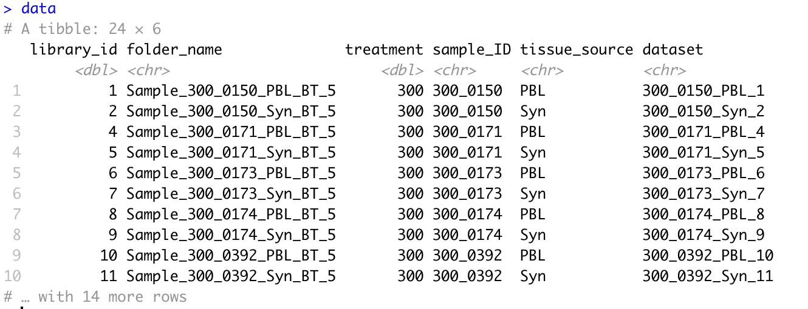

```{r load-packages, message = FALSE}
library(tidyverse)
knitr::opts_chunk$set(error = TRUE)
```

## Text munging

Consider the data in `data/sample_sheet2.csv`.

1.  Read this file in as a .csv.

```{r read-samplesheet}
data = ...
```

It should look like this:



2.  Split the `folder_name` field by the '_' character.  This will give you a character `matrix`.  Take a look at it with view.  

```{r split-folder}
char_matrix = SOME_COMMAND(data, pattern = SOME_CHARACTER, n = SOME_INTEGER)
```

3.  You can extract various columns using `char_matrix[,integer_of_the_column_you_want]`.  Using this and `str_c`, recreate the fields `treatment`, `sample_ID`, `tissue_source`.

```{r}
recreated_data = data %>% select(folder_name) %>% 
  mutate(treatment = SOMETHING,
         sample_ID = str_c(SOMETHING, "something", OTHERTHING),
         tissue_source = SOMETHING)
```


4.  Recreate the field `dataset` by concatenating various fields.

5.  Convert the `dataset` field to be entirely lowercase with `str_to_lower`.

6.  Collapse sample_ID field into a single character vector (length 1) separated by semicolons ";" using `str_c(..., collapse = ...)`.

It should look like this when you are done:

> 300_0150; 300_0150; 300_0171; 300_0171; 300_0173; 300_0173; 300_0174; 300_0174; 300_0392; 300_0392; 300_0410; 300_0410; 300_0414; 300_0414; 300_0415; 300_0416; 300_1883; 300_1930; 300_1930; 301_0174; 301_0174; 301_0174; 301_0270; 301_0270
